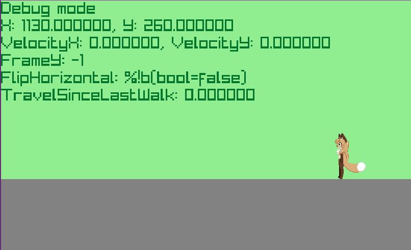

# Go Averi2D Platformer
A Go rewrite of Averi2D

[C version by Flareonkek](https://github.com/Flareonkek/averi2d)

## Controls
W, A, S, D to move
Space to jump or select menu option

## Binaries / Downloads
Binaries for Windows and Linux are available in the [Releases](https://github.com/s5lachlan/go-averi2d/releases)
